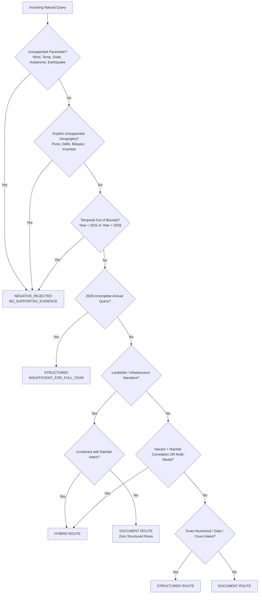

# Deterministic Query Routing Rules & Decision Heuristics (Repaired)

## Himachal Pradesh Extreme Weather RAG System (2011–2026)

### 1. Architectural Philosophy
As specified for Milestone 2B, **no Large Language Model (LLM) is used for query classification**. 
Routing is governed by a deterministic, multi-tier heuristic analyzer (`scripts/hybrid_retriever.py`) that strictly enforces:
1. **Positive Parameter Validation** (Rainfall, Cloudburst, Flash Flood supported; all other meteorological or physical variables fail closed).
2. **Positive Geographic Validation** (Kangra, Mandi, Shimla, Kullu supported; explicit unsupported locations fail closed).
3. **Temporal Bounds** (2011 through 2026; 2026 strictly PARTIAL).
4. **Scope Isolation for Landslides & Impacts** (`LANDSLIDE_NARRATIVE` is strictly DOCUMENT-level, never executing SQL rainfall calculations).
5. **Analytical Operation & Entity Mapping** (Structured calculations vs. qualitative narrative explanations vs. dual-engine fusion).

---

## 2. Target Routing Routes

| Route | Execution Engine | Primary Objective | Example Query |
| :--- | :--- | :--- | :--- |
| `STRUCTURED` | SQLite (`hp_extreme_weather.db`) | Exact numerical statistics, peak rainfall, daily values, event frequencies. | *"What was the maximum rainfall in Kangra in 2023?"* |
| `DOCUMENT` | FAISS Vector Store (`index.faiss`) | Narrative descriptions, institutional damage assessments, geological causation, landslides. | *"What does HPSDMA report about infrastructure damage during the 2023 monsoon?"* |
| `HYBRID` | Fused (SQLite + FAISS) | Questions connecting quantitative meteorological thresholds with ground disaster impacts. | *"Was the July 2023 Kullu disaster associated with extreme rainfall, and what damage occurred?"* |
| `NEGATIVE_REJECTED` | Early Rejection Guard | Immediate return of `NO_SUPPORTED_EVIDENCE` for unsupported parameters, out-of-scope geography, or temporal bounds. | *"What was the maximum rainfall in Pune in 2023?"* |

---

## 3. Signal Hierarchy & Routing Decision Logic

The query analyzer evaluates validation gates in strict priority order:

---

## 4. Multi-Tier Geographic Entity Model

The router enforces a positive supported-domain model and categorizes query geography into one of four states:

1. **`SUPPORTED_GEOGRAPHY`**:
   - Authorized target districts: `Kangra`, `Mandi`, `Shimla`, `Kullu`.
   - Authorized sub-entities and tehsils:
     - Kangra: Dharamshala, Boh, Shahpur, Bhagsunag, Kangra Aero, Nurpur, Palampur, Dehra, Jawalamukhi.
     - Mandi: Sundernagar, Mandi Urban, Kotrupi, Sarkaghat, Jogindernagar, Thunag, Karsog, Pandoh.
     - Shimla: Shimla City, Rampur, Rohru, Theog, Chopal, Jubbal, Kumarsain, Sunni.
     - Kullu: Manali, Bhuntar, Anni, Banjar, Nirmand, Sainj, Tirthan, Chojh, Kasol, Parvati.
2. **`EXPLICIT_UNSUPPORTED_GEOGRAPHY`**:
   - Any explicit geographical entity outside the supported set (e.g. Pune, Delhi, Mumbai, Chandigarh, Dehradun, Bilaspur, Solan, or arbitrary invented names like Atlantis).
   - Identified via spatial constructs (`<Word> district`, `<Word> city`, spatial prepositions `in <Word>`, `at <Word>`, or recognized external regions).
   - **Rule:** **Must fail closed immediately to `NEGATIVE_REJECTED` (`NO_SUPPORTED_EVIDENCE`)**.
   - `explicit unsupported geography != no geography specified`. Under no circumstances will an unsupported entity silently fall back to state-wide or null-district SQL execution.
3. **`STATE_LEVEL`**:
   - Explicit state-wide scope (`Himachal Pradesh`, `H.P.`, `state-wide`, `the state`).
   - Valid only for domain-wide operations (e.g. state-wide cloudburst summaries or state-level maximums).
4. **`NO_GEOGRAPHY_SPECIFIED`**:
   - Query lacks any geographic tokens (e.g. *"What was the maximum rainfall in 2023?"*).
   - Valid only when the requested analytical operation supports domain-wide scope.

---

## 5. Supported Parameter Model & Landslide Scope

### Supported Analytical Schema:
The structured SQL schema (`hp_extreme_weather.db`) is strictly limited to:
1. **`RAINFALL`**: Gridded and station precipitation measurements, daily observations, statistical aggregations.
2. **`CLOUDBURST`**: Discrete canonical cloudburst events and incident frequencies.
3. **`FLASH_FLOOD`**: Discrete canonical flash flood events and inundation records.

### Fail-Closed Unsupported Parameters:
Any query requesting variables outside this schema is rejected immediately with `NO_SUPPORTED_EVIDENCE`:
- Meteorological: `wind speed`, `temperature`, `heatwave`, `solar radiation`, `uv index`, `humidity`, `dew point`, `barometric pressure`, `air quality`, `aqi`, `snowfall depth`.
- Geophysical / Marine: `earthquake`, `richter`, `magnitude`, `seismic tremor`, `tsunami`, `volcano`, `avalanche`, `cyclone`, `tornado`, `meteor`.

**Collision Invariance:** The presence of an exact date (`YYYY-MM-DD`), `"maximum"`, `"how many"`, a target district, or a year cannot override parameter incompatibility. `YYYY-MM-DD` only implies `DATE_RAINFALL` if the parameter is explicitly rainfall or neutral.

### Scope of `LANDSLIDE_NARRATIVE`:
- Keywords such as `landslide`, `debris flow`, `slope failure`, `infrastructure damage`, `road blocked`, `bridge washed`, `casualties`, `deaths`, `fatalities` are strictly **DOCUMENT / NARRATIVE** indicators.
- They **NEVER** execute structured SQL rainfall queries (`get_max_rainfall`, `get_rainfall_by_date`, `get_rainfall_statistics`).
- When asked about landslide impact or road damage, the router routes to `DOCUMENT` (with 0 structured rows).
- When asked whether a landslide disaster was associated with heavy rainfall, the router routes to `HYBRID`.

---

## 6. Illustrative Test Examples

| Query | Routed Route | Intent | Selected Engine Function | Expected Status |
| :--- | :--- | :--- | :--- | :--- |
| *"What was the maximum rainfall in Kangra in 2023?"* | `STRUCTURED` | `MAX_RAINFALL` | `get_max_rainfall('Kangra', 2023)` | `OK` (CALCULATED) |
| *"What was the maximum rainfall in Pune in 2023?"* | `NEGATIVE_REJECTED` | `OUT_OF_SCOPE_GEOGRAPHY_PUNE` | Rejection Guard (Fail Closed) | `NO_SUPPORTED_EVIDENCE` |
| *"What was the wind speed in Shimla on 2023-07-09?"* | `NEGATIVE_REJECTED` | `UNSUPPORTED_PARAMETER_WIND_SPEED` | Rejection Guard (Fail Closed) | `NO_SUPPORTED_EVIDENCE` |
| *"How did landslides affect roads in Mandi in 2023?"* | `DOCUMENT` | `LANDSLIDE_IMPACT_NARRATIVE` | `semantic_search(...)` | `OK` (REPORTED, 0 SQL rows) |
| *"What happened during the Boh/Dharamshala disaster in July 2021?"* | `DOCUMENT` | `EVENT_NARRATIVE` | `semantic_search(...)` | `OK` (REPORTED) |
| *"Was the July 2023 Kullu disaster associated with extreme rainfall?"* | `HYBRID` | `HAZARD_RAINFALL_CORRELATION` | `get_rainfall_statistics()` + `semantic_search()` | `OK` (FUSED) |
| *"What was the annual rainfall in Kangra in 2026?"* | `STRUCTURED` | `ANNUAL_TOTAL_INCOMPLETE` | `get_rainfall_statistics('Kangra', 2026)` | `INSUFFICIENT_FOR_FULL_YEAR` |
| *"How many cloudburst events were documented in Kangra in 2016?"* | `STRUCTURED` | `EVENT_COUNT` | `get_events_by_year(2016, 'Kangra', 'Cloudburst')` | `ZERO_DOCUMENTED_EVENTS` |
